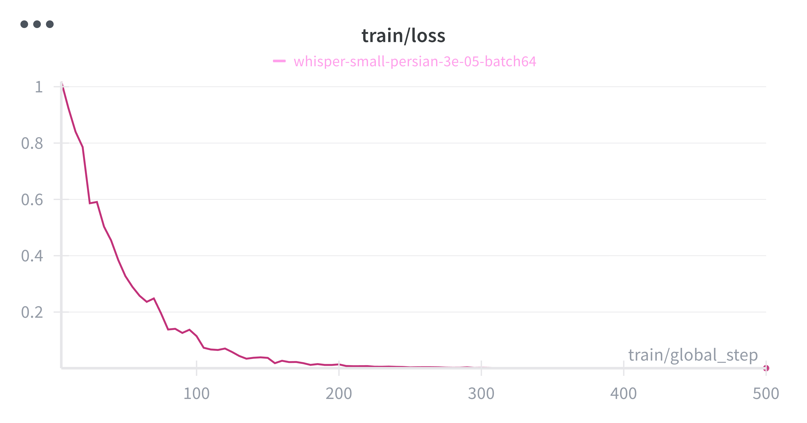
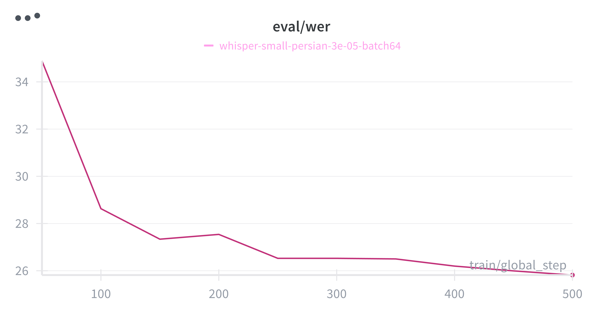

# Whisper Persian Fine-tuning

A guide for training and deploying your own Whisper model for Persian speech recognition. This repository demonstrates the complete pipeline: from fine-tuning on the FLEURS Farsi dataset to quantization for efficient local inference.

## 🚀 Quick Start

- **Live Demo**: [Try the model online](https://huggingface.co/spaces/AmirMohseni/Whisper-small-Farsi)
- **Trained Model**: [Download from Hugging Face](https://huggingface.co/AmirMohseni/whisper-small-persian)

## 📋 Prerequisites

### Quick Setup (Recommended)

Run the automated setup script:

```bash
chmod +x setup.sh
./setup.sh
```

This will:
- ✅ Create and activate a virtual environment
- ✅ Install all required dependencies
- ✅ Create `.env` file from template
- ✅ Set up your environment for training

### Manual Setup (Alternative)

```bash
# Create and activate virtual environment
uv venv
source .venv/bin/activate  # On Windows: .venv\Scripts\activate

# Install dependencies
uv pip install -r requirements.txt

# Set up environment file
cp .env.example .env
# Edit .env file with your Hugging Face token
```

### Authentication

**You need a Hugging Face token to publish models:**

1. Go to [Hugging Face Settings > Tokens](https://huggingface.co/settings/tokens)
2. Create a new token with "Write" permissions
3. Add it to your `.env` file:
   ```bash
   HF_TOKEN=your_actual_token_here
   ```

The setup script will create the `.env` file for you, just replace `your_token_here` with your actual token.

## 🎯 Training

### Quick Start

```bash
python whisper_trainer.py
```

### Configuration

Customize training by editing `configs.yaml`:

```yaml
# Dataset settings
dataset:
  name: "MohammadGholizadeh/fleurs-farsi"
  train_split: "train[:50%]"  # 50% of training data
  test_split: "dev[:50%]"    # 50% of dev data

# Training parameters
training:
  learning_rate: 3e-5
  per_device_train_batch_size: 32
  max_steps: 500
  warmup_steps: 100

# Output settings
output:
  output_dir: "./whisper-small-persian"
  push_to_hub: true
```

**Key Parameters:**
- `learning_rate`: Controls training speed (try 1e-5 to 5e-5)
- `max_steps`: Training duration (500 steps ≈ 2 hours on L4 GPU)
- `per_device_train_batch_size`: Memory vs speed trade-off
- `push_to_hub`: Set to `false` for local-only training

## 📊 Training Results

The model achieves **25.8% WER** on the FLEURS Farsi evaluation set, representing a significant improvement over the base Whisper model.

### Training Progress

| Step | Training Loss | Validation Loss | WER    | Epoch |
|------|---------------|-----------------|--------|-------|
| 50   | 0.3277       | 0.3894         | 34.89% | 2.0   |
| 100  | 0.1146       | 0.3268         | 28.63% | 4.0   |
| 150  | 0.0373       | **0.3289**     | 27.34% | 6.0   |
| 200  | 0.0142       | 0.3390         | 27.54% | 8.0   |
| 250  | 0.0036       | 0.3523         | 26.53% | 10.0  |
| 300  | 0.0024       | 0.3677         | 26.53% | 12.0  |
| 350  | 0.0010       | 0.3734         | 26.50% | 14.0  |
| 400  | 0.0007       | 0.3777         | 26.20% | 16.0  |
| 450  | 0.0007       | 0.3807         | 25.99% | 18.0  |
| **500** | **0.0006**   | **0.3818**     | **25.82%** | **20.0** |

*Final performance: 25.8% WER with 0.38 validation loss*

### Training Curves




## 🔧 Quantization & Deployment

Reduce model size and memory usage for local deployment:

```bash
python quantize_and_push.py
```

**What it does:**
- ✅ Loads your fine-tuned model
- ✅ Applies 16-bit and 8-bit quantization (reduces memory by ~50%)
- ✅ Saves quantized model locally
- ✅ Uploads to Hugging Face Hub
- ✅ Enables efficient CPU inference

## Usage

### Basic Usage

```python
from transformers import pipeline

# Load the fine-tuned model
pipe = pipeline("automatic-speech-recognition", model="AmirMohseni/whisper-small-persian")

# Transcribe audio file
result = pipe("path/to/audio.wav")
print(result["text"])  # Persian transcription
```

### Advanced Usage with Custom Settings

```python
from transformers import AutoModelForSpeechSeq2Seq, AutoProcessor
import torch

# Load model and processor
model = AutoModelForSpeechSeq2Seq.from_pretrained("AmirMohseni/whisper-small-persian")
processor = AutoProcessor.from_pretrained("AmirMohseni/whisper-small-persian")

# Process audio and generate transcription
inputs = processor(audio, sampling_rate=16000, return_tensors="pt")
with torch.no_grad():
    generated_ids = model.generate(inputs["input_features"])

transcription = processor.batch_decode(generated_ids, skip_special_tokens=True)[0]
print(transcription)
```

### Batch Processing

```python
import os
from pathlib import Path

# Process multiple audio files
audio_dir = Path("audio_files/")
results = []

for audio_file in audio_dir.glob("*.wav"):
    result = pipe(str(audio_file))
    results.append({
        "file": audio_file.name,
        "text": result["text"]
    })

# Save results
import json
with open("transcriptions.json", "w", encoding="utf-8") as f:
    json.dump(results, f, ensure_ascii=False, indent=2)
```

## 🔍 Troubleshooting

### Common Issues

**CUDA Out of Memory:**
```yaml
# Reduce in configs.yaml
training:
  per_device_train_batch_size: 16  # or 8
  gradient_accumulation_steps: 4    # increase accordingly
```

**Slow Training:**
- Use a GPU with more VRAM
- Reduce `max_steps` for faster experimentation
- Increase `per_device_train_batch_size` (if memory allows)

**Poor Model Performance:**
- Try different learning rates (1e-5 to 5e-5)
- Increase `max_steps` for more training
- Use more training data (remove `[:50%]` splits)

**Quantization Issues:**
- Ensure you have enough RAM for quantization (model loads into memory)
- Check that `bitsandbytes` is properly installed
- Use the quantized model for inference, not the full-precision version

### Getting Help

- Check the [Whisper documentation](https://huggingface.co/docs/transformers/model_doc/whisper)
- Review training logs for error messages
- Validate your `configs.yaml` syntax with a YAML validator
